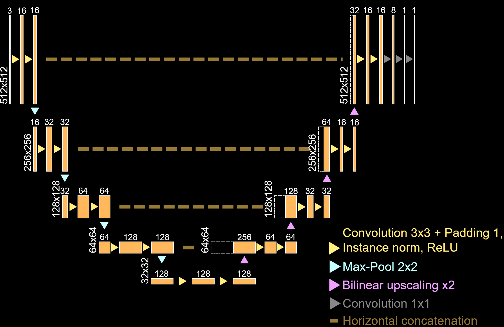

# U-Net model implementation
This repository contains code used to train a UNet model on histopathological breast cancer images, using CODEX-derived binary mask labels. Training images are shape (512, 512, 3) RGB .tif images and label images are (512, 512, C) multi-channel .tif images where the channel to train on is indexed in `dataset.py`

In order to replicate this project, structure a data folder like the following:

<pre>
data/
├─ marker-specific-dataset_01/
│  ├─ he/
│  │  ├─ img_0.tif
│  │  └─ img_1.tif
│  └─ masks/
│     ├─ img_0_mask.tif
│     └─ img_1_mask.tif
│  
└─ marker-specific-dataset_02/
   ├─ he/
   │  ├─ img_0.tif
   │  └─ img_1.tif
   └─ masks/
      ├─ img_0_mask.tif
      └─ img_1_mask.tif
</pre>

  
   

In order to configure dlup and pyvips, Add Windows binary files to your windows PATH folder and import them through `os.add_dll_directory("FILE_PATH")`. File paths are configured through Hydra-Core in `conf/config.yaml` and `src/config.py`.

* pyvips: https://github.com/libvips/build-win64-mxe/releases/tag/v8.15.0  
* openslide (for dlup): https://openslide.org/download/
