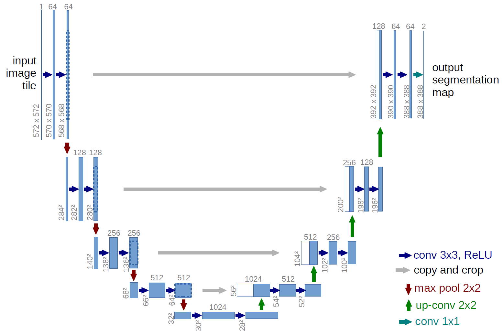

# U-Net model implementation
As of 27-10-2023, this is placeholder code for my future generated mask data. For now, I use publicly available data: https://www.kaggle.com/datasets/newra008/lung-mask-image-dataset

To replicate project, download the dataset and create a data folder in the root directory. Move train/ test/ and val/ folders to your created data folder.

  
   

In order to configure dlup and pyvips, Add Windows binary files to your windows PATH folder and import them through `os.add_dll_directory("FILE_PATH")`. File paths are configured through Hydra-Core in `conf/config.yaml` and `src/config.py`.

* pyvips: https://github.com/libvips/build-win64-mxe/releases/tag/v8.15.0  
* openslide (for dlup): https://openslide.org/download/
